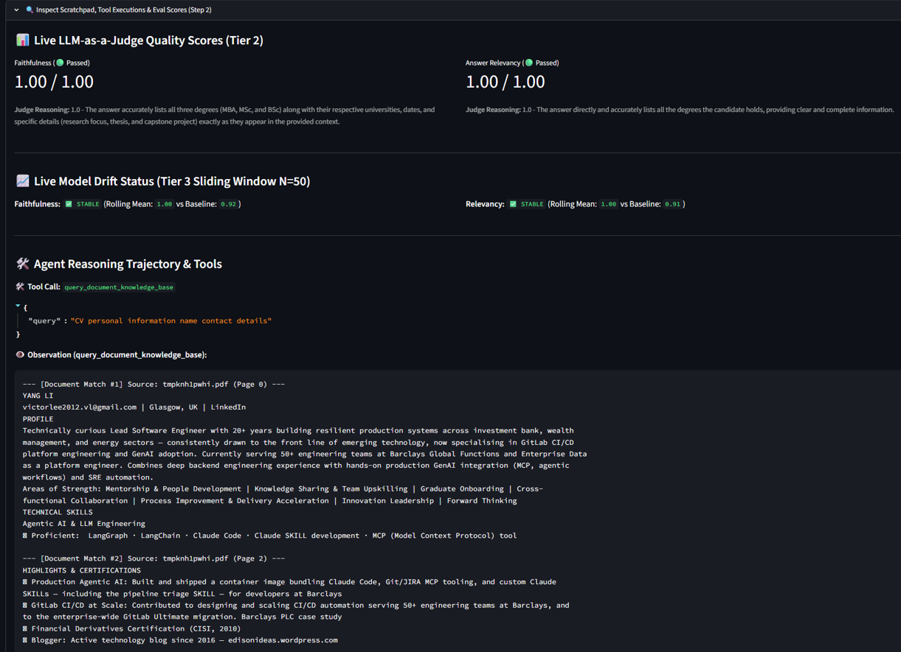

# local-rag-example

Build and explore local RAG and AI Agent architectures locally using LangChain, LangGraph, Ollama, Redis, and Streamlit.

---

## 🌟 Architectures Included

1. **RAG (Classic)**: Standard document retrieval chain with `HuggingFaceEmbeddings` + `Chroma` + `ChatOllama` (`glm-5.2:cloud`).
2. **AGENT (SmolAgent)**: Dynamic routing between `CodeAgent` and `ToolCallingAgent` via LiteLLM & Ollama.
3. **Agentic RAG (LangGraph + Redis Checkpointer + Live LLM Judge)**: Implements the **3. Complete Agent Architecture** pattern from `Agent.md` featuring:
   - **AgentCore**: ReAct loop (`Thought -> Action -> Observation`) with LangGraph.
   - **4. Tools**: Document knowledge base retrieval (`query_document_knowledge_base`), local file inspection (`read_local_file`), and mathematical calculation (`calculate_expression`).
   - **3. Short-term Memory**: Multi-turn conversation persistence & agent scratchpads backed by **Redis Checkpointer** (`RedisSaver` / `AsyncRedisSaver`), with in-memory fallback.
   - **Engineering Essentials (Live Evaluation & Drift Detection)**:
     - **Tier 1**: Instant heuristic quality and length sanitization.
     - **Tier 2**: On-demand / live **LLM-as-a-Judge** scoring (Faithfulness & Answer Relevancy) via `OllamaJudge`.
     - **Tier 3**: Continuous **Sliding Window Model Drift Detection** comparing rolling score distributions against pre-deployment CI/CD baselines (`baseline_metrics.json`).

---

## 📸 Agentic RAG Live Evaluation & Drift Monitoring in Action



---

## 🚀 Quick Setup

### 1. Install Dependencies with `uv`

```bash
uv sync
```

### 2. Host Local Redis Server in Docker (Optional for Short-term Memory Checkpointing)

The Agentic RAG tab automatically connects to Redis at `redis://localhost:6379`. If Redis is not running, it gracefully falls back to in-memory memory storage (`MemorySaver`).

To enable persistent multi-turn Redis checkpointing, run Redis Stack in Docker (required for `RedisJSON` / `JSON.SET` commands used by `langgraph-checkpoint-redis`):

#### Option A: Redis Stack Server (Lightweight)

```bash
docker run -d --name local-redis -p 6379:6379 redis/redis-stack-server:latest
```

#### Option B: Redis Stack (Includes RedisInsight Web UI on http://localhost:8001)

```bash
docker run -d --name redis-stack -p 6379:6379 -p 8001:8001 redis/redis-stack:latest
```

#### Option C: Docker Compose

Use `docker-compose.yml`:

```yaml
version: '3.8'
services:
  redis:
    image: redis/redis-stack:latest
    container_name: redis-stack
    ports:
      - "6379:6379"
      - "8001:8001"
    restart: unless-stopped
```

Start Redis with:

```bash
docker compose up -d
```

To stop or verify Redis:

```bash
# Check running container
docker ps

# Test Redis connection
docker exec -it local-redis redis-cli ping
# Expected output: PONG

# Stop Redis container
docker stop local-redis
```

---

### 3. Run the Streamlit Application

```bash
uv run streamlit run app.py
```

---

## 📖 Complete Agent Architecture Pattern

For detailed concepts, diagrams, and interview notes regarding Agent design paradigms, see [Agent.md](Agent.md).
For code design and module organization, see [IMPLEMENTATION.md](IMPLEMENTATION.md).

---

## 🔗 References

- Hackernoon Tutorial: [A Tutorial on How to Build Your Own RAG and Run It Locally](https://hackernoon.com/a-tutorial-on-how-to-build-your-own-rag-and-how-to-run-it-locally-langchain-ollama-streamlit)
- LangGraph Documentation: [https://langchain-ai.github.io/langgraph/](https://langchain-ai.github.io/langgraph/)
- Redis Checkpoint: [https://github.com/langchain-ai/langgraph/tree/main/libs/checkpoint-redis](https://github.com/langchain-ai/langgraph/tree/main/libs/checkpoint-redis)
