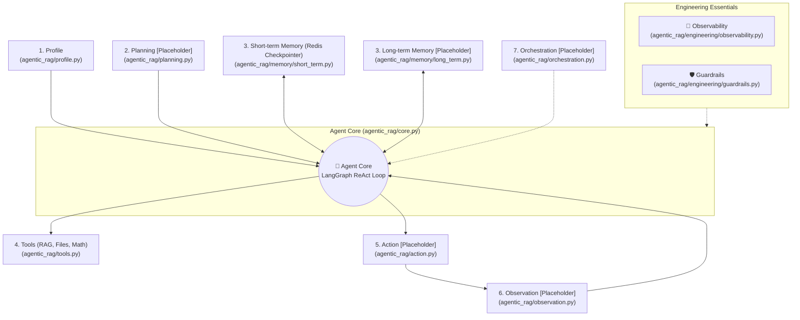

# Agentic RAG Implementation: Complete Agent Architecture Pattern

This document tracks the technical implementation of the **Agentic RAG** subsystem in `local-rag-ollama`, designed according to **Section 3: Complete Agent Architecture** in [`Agent.md`](Agent.md).

---

## 1. Architecture Overview & Component Mapping

All agentic code is strictly isolated inside the [`agentic_rag/`](agentic_rag/) package. The table below illustrates how each architectural element from `Agent.md` is realized:



---

## 2. Directory Structure

```
local-rag-ollama/
├── agentic_rag/
│   ├── __init__.py                     # Package entry point exposing all components
│   ├── agent.py                        # High-level AgenticRAGHelper facade for Streamlit
│   ├── core.py                         # [IMPLEMENTED] AgentCore with LangGraph ReAct loop
│   ├── profile.py                      # [IMPLEMENTED] 1. Profile (Personas & Prompt constraints)
│   ├── planning.py                     # [PLACEHOLDER] 2. Planning (Task decomposition & reflection)
│   ├── memory/
│   │   ├── __init__.py
│   │   ├── short_term.py               # [IMPLEMENTED] 3. Short-term Memory (RedisSaver checkpointer)
│   │   └── long_term.py                # [PLACEHOLDER] 3. Long-term Memory (Episodic & Summary store)
│   ├── tools.py                        # [IMPLEMENTED] 4. Tools (RAG vector query, file read, math)
│   ├── action.py                       # [PLACEHOLDER] 5. Action (Outbound dispatch & formatting)
│   ├── observation.py                  # [PLACEHOLDER] 6. Observation (Feedback parsing & reflection)
│   ├── orchestration.py                # [PLACEHOLDER] 7. Orchestration (Multi-agent supervisor graphs)
│   └── engineering/
│       ├── __init__.py
│       ├── observability.py            # [PLACEHOLDER] Observability (Step tracing & metrics)
│       └── guardrails.py               # [PLACEHOLDER] Guardrails (Input/output safety & policies)
├── app.py                              # Streamlit app with 3 tabs: RAG, AGENT, Agentic RAG
├── pyproject.toml                      # Updated with langgraph, langgraph-checkpoint-redis, redis
├── README.md                           # Updated with Docker Redis deployment guide
├── Agent.md                            # Reference AI Agent architecture cheat sheet
└── IMPLEMENTATION.md                   # This implementation tracking document
```

---

## 3. Implemented Components Deep Dive

### A. Agent Core (`agentic_rag/core.py`)
- Built on **LangGraph** `create_react_agent` state machine.
- Binds `ChatOllama` (default `glm-5.2:cloud`), the toolset, system prompt profile, and the short-term memory checkpointer.
- Executes the `Thought -> Action (Tool Call) -> Observation (Tool Result) -> Answer` cycle.

### B. 4. Tools (`agentic_rag/tools.py`)
- `query_document_knowledge_base(query: str)`: Searches Chroma vector store containing ingested PDF chunks with cosine similarity.
- `read_local_file(file_path: str)`: Directly inspects local files (PDF text extraction via `pypdf` or raw text).
- `calculate_expression(expression: str)`: Computes mathematical formulas safely.
- `DocumentRetrieverManager`: Manages chunking, embedding (`all-MiniLM-L6-v2`), and Chroma indexing.

### C. 3. Short-term Memory & Redis Checkpointing (`agentic_rag/memory/short_term.py`)
- Integrates `langgraph-checkpoint-redis` with `RedisSaver` (and `AsyncRedisSaver`).
- Persists full multi-turn dialogue state and intermediate agent scratchpads keyed by `thread_id`.
- **Fault Tolerant**: Performs non-blocking ping checks on initialization (`redis://localhost:6379`). If Redis is not currently active, it automatically falls back to `MemorySaver` without failing.

### D. Helper Facade (`agentic_rag/agent.py`)
- Provides `AgenticRAGHelper` with clean methods:
  - `ingest_document(path)`: PDF ingestion into knowledge base.
  - `ask(query, thread_id)`: Executes ReAct loop and extracts final answer + structured scratchpads.
  - `get_redis_status()`: Inspects Redis connection state for UI rendering.
  - `clear_documents()`: Resets knowledge base.

---

## 4. UI Integration in `app.py`

Tab 3 (**"Agentic RAG"**) provides:
1. **Redis Status Indicator**: Live badge reflecting active Redis connection or in-memory fallback.
2. **Document Ingestion**: Multi-file PDF uploader dedicated to Agentic RAG.
3. **Session / Thread ID Selector**: Configurable `thread_id` to demonstrate multi-turn persistence across sessions.
4. **Interactive Chat & Scratchpad Expander**: Shows conversation messages alongside collapsible **"🔍 Inspect Scratchpad & Tool Executions"** showing intermediate tool calls, inputs, and observations.
5. **Reset Button**: Resets current thread state and document stores.

---

## 5. Hosting Local Redis with Docker

As documented in `README.md`, start a local Redis container with:

```bash
# Standard lightweight Redis
docker run -d --name local-redis -p 6379:6379 redis:alpine

# Or Redis Stack with RedisInsight UI on port 8001
docker run -d --name redis-stack -p 6379:6379 -p 8001:8001 redis/redis-stack:latest
```
